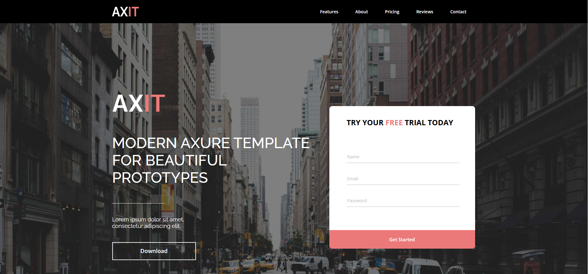

# Axit
 https://yyanas.github.io/Axit/

This is a modern, adaptive landing page created from an Axure mockup. The project demonstrates front-end development using semantic HTML5 and modern CSS3 features, including custom properties (CSS Variables) and Flexbox.

## 🚀 About the Project

This project presents a landing page with a well-thought-out structure and interactive elements.

## 🛠 Technologies

- **HTML5** - Semantic and accessible markup.
- **CSS3** - Styling using:
  - CSS Custom Properties for colors, fonts, and sizes.
  - Flexbox for layout construction.
  - Pseudo-classes (`:hover`, `:active`, `:focus`) for interactivity.
  - Positioning (`relative`, `absolute`).
  - Smooth transitions (`transition`).
- **Google Fonts** - Fonts `Raleway` and `Open Sans`.
- **SVG** - Vector icons for social networks.
